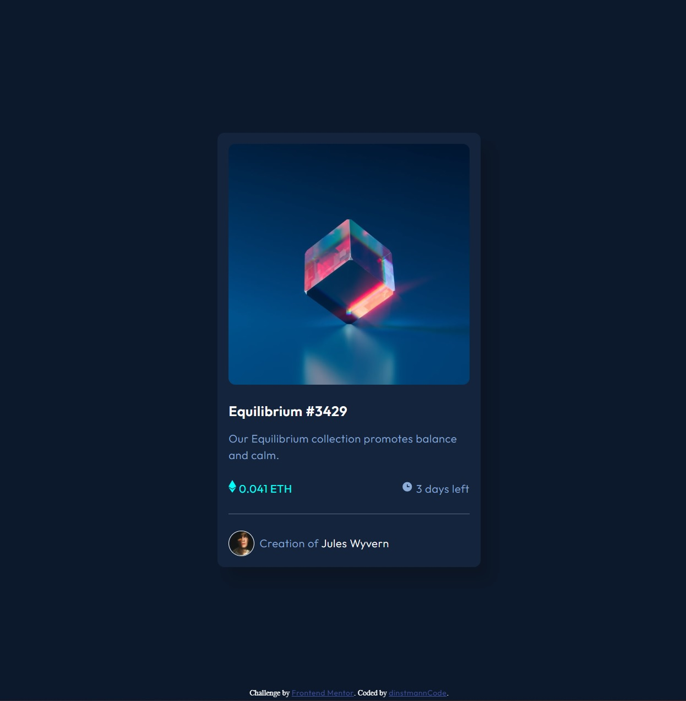
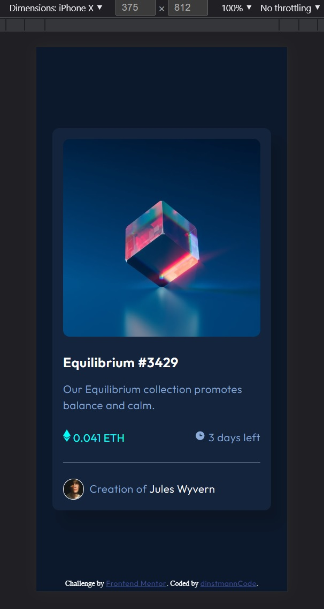

# Frontend Mentor - NFT preview card component solution

This is a solution to the [NFT preview card component challenge on Frontend Mentor](https://www.frontendmentor.io/challenges/nft-preview-card-component-SbdUL_w0U).
### The challenge
Users should be able to:

- View the optimal layout depending on their device's screen size
- See hover states for interactive elements

### Screenshot
Desktop

Mobile

### Links

- Solution URL: [Github](https://github.com/dinstmannCode/nft-preview-card)
- Live Site URL: (https://nft-preview-card-dinstmanncode.vercel.app/)

## My process

### Built with

- Semantic HTML5 markup
- CSS custom properties
- Flexbox

## Author

- LinkedIn - [Marilia Dinstmann](https://www.linkedin.com/in/marilia-dinstmann/)
- Frontend Mentor - [@dinstmannCode](https://www.frontendmentor.io/profile/dinstmannCode)

